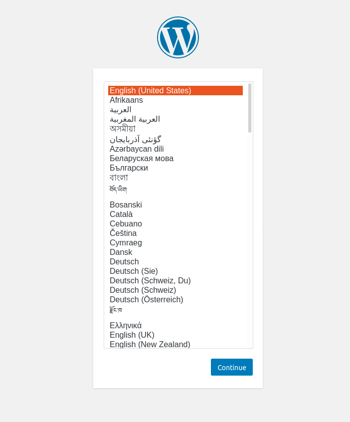

## WordPress sample configuration
### WordPress blog examples with traefik

Project structure:
```
.
├── secrets
│   ├── mysql-database.txt
│   ├── mysql-user.txt
│   ├── mysql-password.txt
├── docker-compose.yaml
└── README.md
```

[_docker-compose.yaml_](docker-compose.yaml)
```
version: '3.7'
services:
  database:
    image: mysql:5.7
    restart: unless-stopped
    environment:
      .
      .
      .

  blog:
    image: wordpress
    restart: unless-stopped
    environment:
      .
      .
      .
    networks:
      - lan
      - traefik_web
    volumes:
      - html:/var/www/html
    labels:
      traefik.enable: true
      traefik.docker.network: traefik_web
      traefik.http.routers.wordpress.entrypoints: websecure
      traefik.http.routers.wordpress.rule: 'Host(`wordpress.mydomain.com`)'
      traefik.http.services.wordpress.loadbalancer.server.port: 80
    .
    .
    .

networks:
  traefik_web:
    external: true

  lan:

```

The compose file defines an application *WordPress* with two services `database` and `blog`.
Database used is `mysql:5.7`, this in order to correspond to the official documentation. You can use `mariadb:10` instead of mysql.
When deploying the application, docker-compose use secrets to store sensitive data like password or database information. This stack use *Traefik* network and service as reverse-proxy.

## Prerequisites

Launch *Traefik* first. Please refer at `README.md` [here](https://github.com/lfache/awesome-traefik/blob/master/README.md) for more information.

Modify secrets with your own password.

## Deploy with docker-compose

```
$ docker-compose up -d

Creating volume "wordpress_db" with default driver
Creating volume "wordpress_html" with default driver
Pulling database (mysql:5.7)...
5.7: Pulling from library/mysql
.
.
.
Digest: sha256:517d651577278f3e30ba93ad7c0ed342fdc8550bcde96a54b33ef0580ffec079
Status: Downloaded newer image for mysql:5.7
Pulling blog (wordpress:)...
latest: Pulling from library/wordpress
.
.
.
Status: Downloaded newer image for wordpress:latest
Creating wordpress_blog_1     ... done
Creating wordpress_database_1 ... done
```

## Expected result

Listing containers must show two containers running:
```
$ docker ps
CONTAINER ID        IMAGE               COMMAND                  CREATED             STATUS              PORTS                                      NAMES
08c0177c5184        wordpress           "docker-entrypoint.s…"   3 minutes ago       Up 3 minutes        80/tcp                                     wordpress_blog_1
76447f6f9fd9        mysql:5.7           "docker-entrypoint.s…"   3 minutes ago       Up 3 minutes        3306/tcp, 33060/tcp                        wordpress_database_1
b2c95cb59ba3        traefik:2.2         "/entrypoint.sh trae…"   14 minutes ago      Up 14 minutes       0.0.0.0:80->80/tcp, 0.0.0.0:443->443/tcp   traefik_reverse_proxy_1
```

After the application starts, navigate to `https://wordpress.mydomain.com` in your web browser to access wordpress installation:



Stop and remove the containers
```
$ docker-compose down
```

Stop and remove containers and volumes
```
$ docker-compose down -v
```
